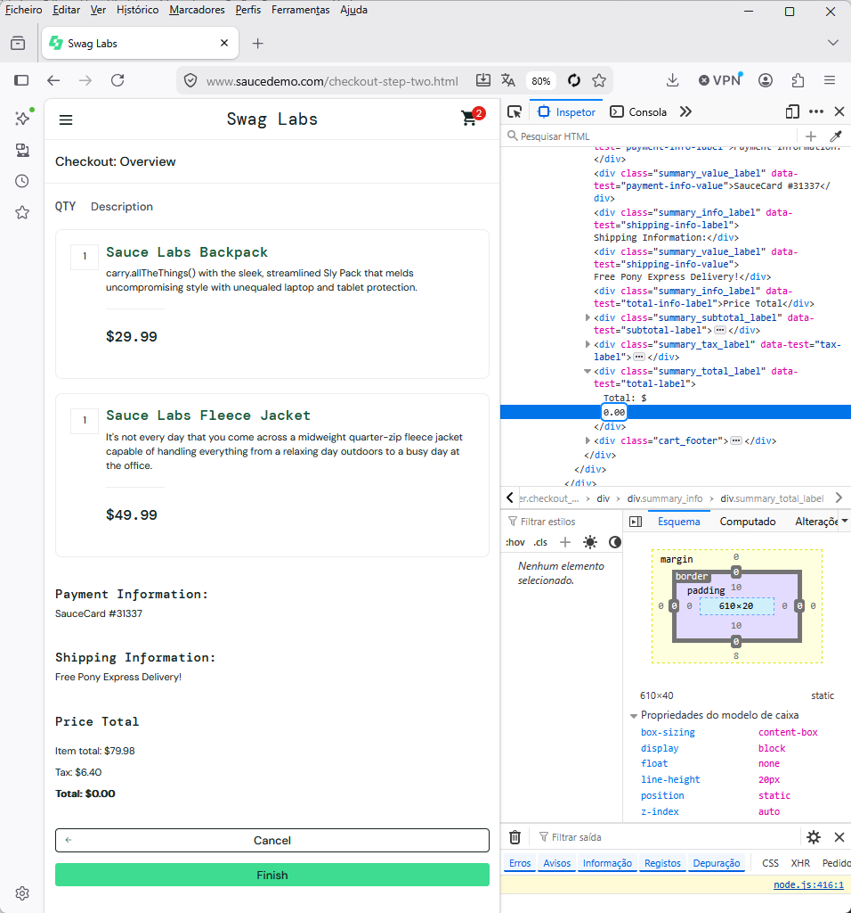

# Bug Report – Erro no cálculo total do checkout

**Título:** Soma incorreta do valor "Total" na página de "Checkout: Overview"
**Severity:** Crítica
**Priority:** Alta
**Ambiente:** Chrome / Produção (saucedemo.com)

## Passos:
1. Fazer login com credenciais válidas (ex: `standard_user`).
2. Adicionar os produtos "Sauce Labs Backpack" ($29.99) e "Sauce Labs Bike Light" ($9.99) ao carrinho.
3. Ir para o carrinho e clicar em "Checkout".
4. Preencher First Name, Last Name e Zip Code e clicar em "Continue".
5. Na página de Overview, verificar os valores listados em "Item total", "Tax" e "Total".

**Resultado Esperado:** 
O "Item total" deveria ser $39.98. Somando com a taxa de 8% (aprox. $3.20), o "Total" final deveria ser $43.18.

**Resultado Obtido:** 
O valor cobrado no "Total" está aparecendo como um valor diferente (ex: $45.00), indicando que a soma dos produtos com as taxas está incorreta, podendo lesar o cliente ou a empresa.

**Evidência:** 

