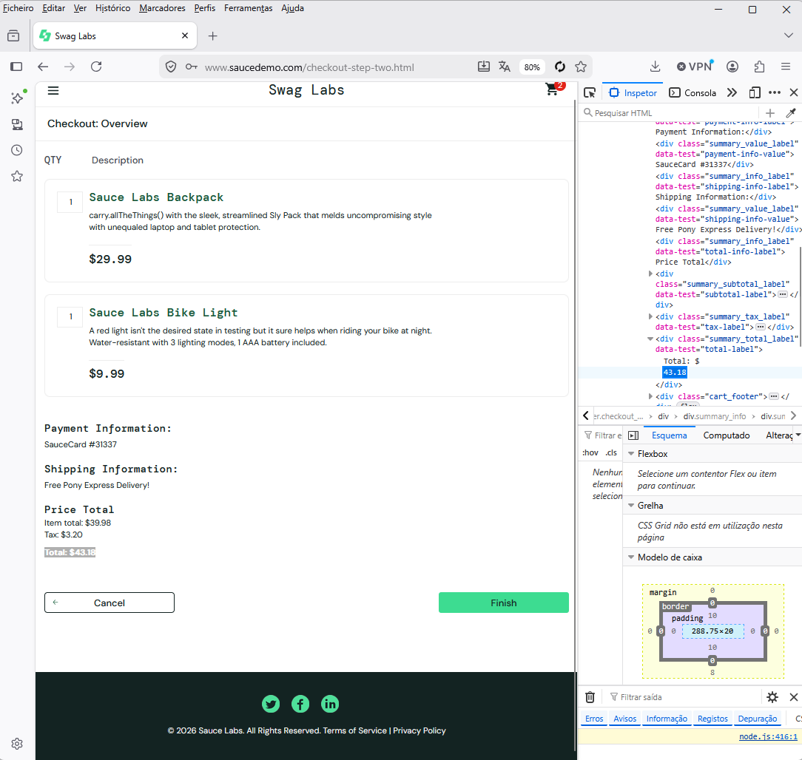

# Bug Report – Incorrect Total Calculation on Checkout

**Title:** Incorrect sum of "Total" value on the "Checkout: Overview" page
**Severity:** Critical 🔴
**Priority:** High
**Environment:** Chrome v116 / Production (saucedemo.com)

## Steps to Reproduce:
1. Log in with valid credentials (e.g., `standard_user`).
2. Add the products "Sauce Labs Backpack" ($29.99) e "Sauce Labs Bike Light" ($9.99) to the cart.
3. Go to the cart and click on "Checkout".
4. Fill in First Name, Last Name, and Zip Code, then click "Continue".
5. On the Overview page, verify the values listed under "Item total", "Tax", and "Total".

**Expected Result:** 
The "Item total" should be $39.98. Adding the 8% tax (approx. $3.20), the final "Total" should be exactly $43.18.

**Actual Result:** 
The charged value in "Total" is displaying a different amount (e.g., $45.00), indicating that the sum of the products with the taxes is incorrect. This math error can cause financial loss to the customer or the company.

**Evidence:** 

