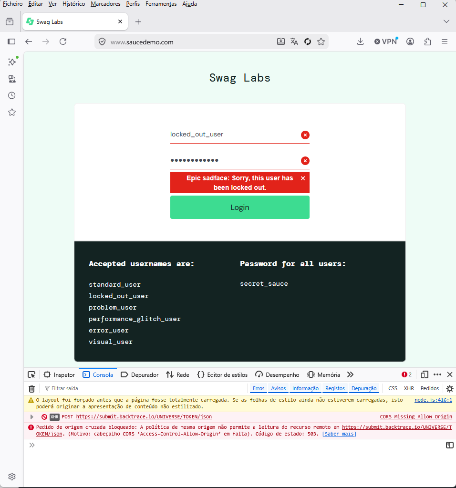

# Bug Report – Erro 500 ao fazer login

**Título:** Erro 500 ao tentar login com credenciais válidas
**Severity:** Alta
**Priority:** Imediata
**Ambiente:** Chrome / Produção

## Passos:
1. Abrir página de login
2. Inserir email válido
3. Inserir senha válida
4. Clicar em Login

**Resultado Esperado:** Usuário autenticado
**Resultado Obtido:** Erro 500 no servidor
**Evidência:** 

